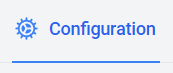
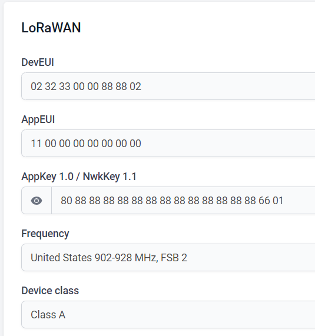

# Main board basic configuration
## [Product page](https://heltec.org/project/htcc-ab01-v2/)
## [Documentation page](https://docs.heltec.cn/en/node/asr650x/htcc_ab01/index.html)


Board selection:


Basic lorawan selection:


For Datacake LNS LoRaWAN, go to configuration view



Test values to match with programming file:



Payload Decoder

```javascript
function Decoder(payload, port) {

        return [
        {
            field: "DATA_TEST0",
            value: payload[0]
        },
    
        {
            field: "DATA_TEST1",
            value: payload[1]
        },    
        
        {
            field: "DATA_TEST2",
            value: payload[2]
        },   
        
     ];

} 
```
